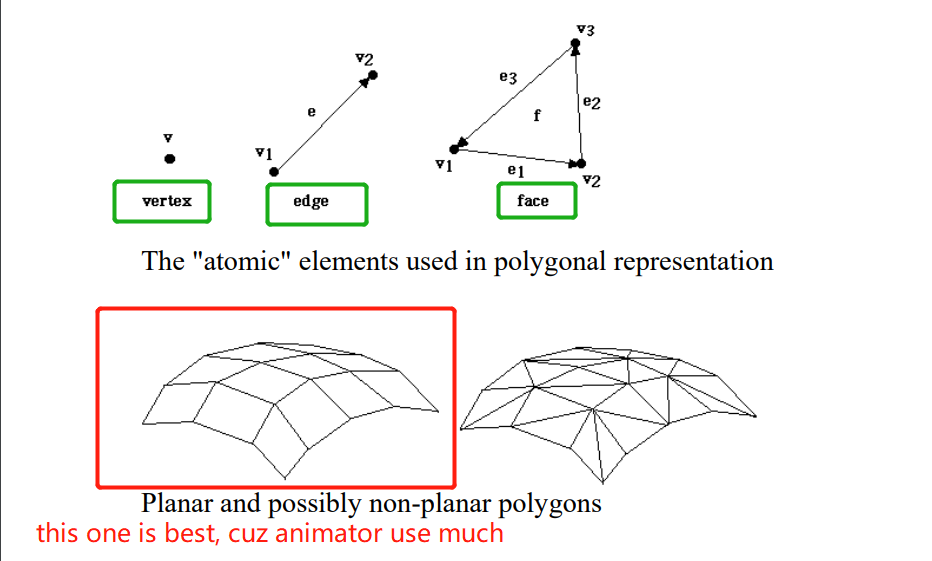

# Polygonal representation

Polygon is a representation of the surface. It is primitive which is closed in nature. It is formed using a collection of lines. It is also called as many-sided figure. The lines combined to form polygon are called sides or edges. The lines are obtained by combining two vertices.

## Level of detail (LOD)
> 渲染优化

如果两个面的法向量夹角差距很大，不合并两个面，如果差距很小，可以合并到一个面

# Parametric representation

## explicit / implicit
parametric representation都是explicit 

## tangent of curve & surface

## three questions

## cubic polymonials curve segments 三次多项式方程
用三次多项式方程画面

# Constructive solid geometry (CSG)
csg的全称是Constructive Solid Geometry，也就是体素构造表示形式。godot引擎中有支持。主要用于一些形状间的结合，通过联合，相交，相减的操作来组成一个新的网格体。这种技术在有号距离场的形状距离识别中也有相应的应用。

> Prototyping levels with CSG — Godot Engine (stable) documentation in English
> https://docs.godotengine.org/en/stable/tutorials/3d/csg_tools.html

# Volumetric representation